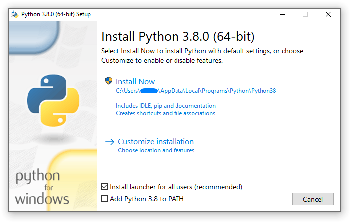
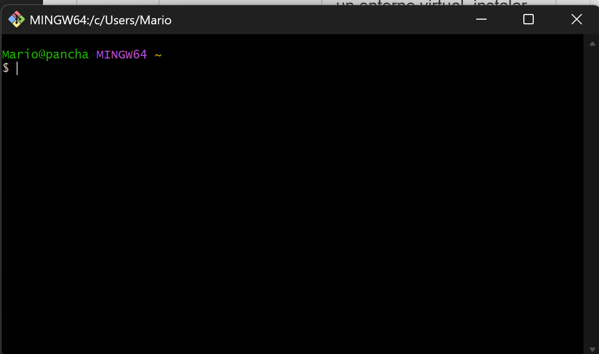
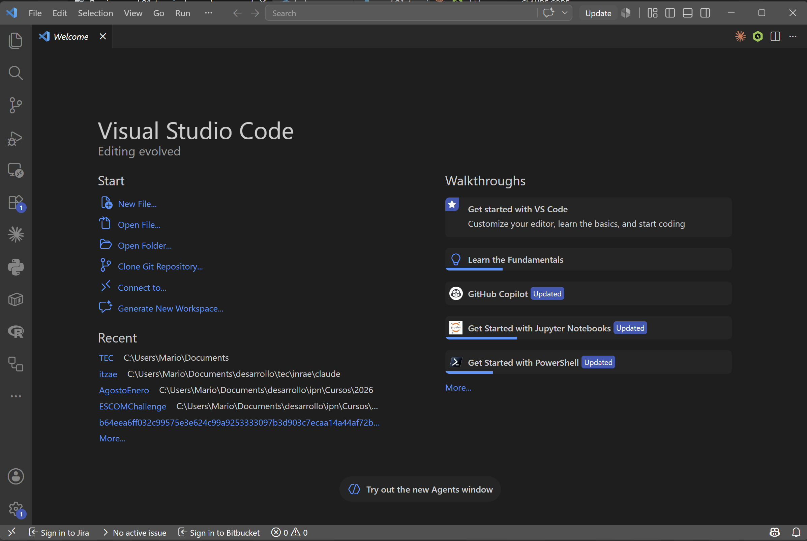
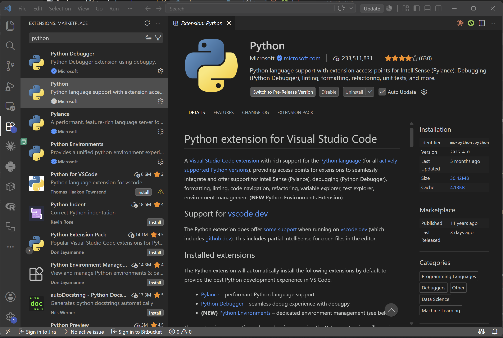

# Semana 1 — Terminal + VS Code + Entornos Virtuales

**Programación para Ciencia de Datos**
Sesiones: martes 25, miércoles 26 y viernes 28 de agosto de 2026

---

## Antes de la primera clase — Instalación

Necesitas tener instalados **3 programas** antes del martes 25 de agosto. Si llegas sin ellos, no podrás seguir la clase.

### 1. Python 3.10 o superior

**Descarga:** [python.org/downloads](https://www.python.org/downloads/)

**Pasos de instalación (Windows):**
1. Descargar el instalador de la versión más reciente (ej. Python 3.12.x).
2. **MUY IMPORTANTE:** en la primera pantalla del instalador, marcar la casilla **"Add python.exe to PATH"** antes de hacer clic en "Install Now".



3. Clic en "Install Now" y esperar a que termine.
4. Verificar en la terminal:

```bash
$ python --version
Python 3.12.4
```

Si ves el número de versión (3.10 o superior), la instalación fue exitosa.

**Mac:** Python 3 suele venir preinstalado en versiones recientes de macOS. Verificar con `python3 --version`. Si no está, instalar con [Homebrew](https://brew.sh/): `brew install python`.

**Linux:** Verificar con `python3 --version`. Si no está, instalar con el gestor de paquetes de tu distribución: `sudo apt install python3 python3-venv python3-pip` (Ubuntu/Debian).

### 2. Git (incluye Git Bash en Windows)

**Descarga:** [git-scm.com/downloads](https://git-scm.com/downloads)

**Pasos de instalación (Windows):**
1. Descargar el instalador y ejecutarlo.
2. Durante la instalación, dejar todas las opciones por defecto excepto:
   - En **"Choosing the default editor used by Git"**, seleccionar **"Use Visual Studio Code as Git's default editor"** (en lugar de Vim).
   - En **"Adjusting the name of the initial branch"**, seleccionar **"Override the default branch name"** y escribir `main`.
3. Completar la instalación.
4. Verificar abriendo **Git Bash** (buscar en el menú de inicio) y ejecutar:

```bash
$ git --version
git version 2.45.1
```

5. Configurar tu nombre y correo (se usarán en cada commit):

```bash
$ git config --global user.name "Tu Nombre"
$ git config --global user.email "tu_correo@ejemplo.com"
```

**Mac:** Instalar con `brew install git` o ejecutar `git --version` (macOS te ofrece instalarlo automáticamente si no lo tiene).

**Linux:** `sudo apt install git` (Ubuntu/Debian).

### 3. Visual Studio Code

**Descarga:** [code.visualstudio.com](https://code.visualstudio.com/)

**Pasos de instalación (Windows):**
1. Descargar el instalador y ejecutarlo.
2. Durante la instalación, marcar estas opciones:
   - **"Add to PATH"** (para poder abrir VS Code desde la terminal con `code .`)
   - **"Register Code as an editor for supported file types"**
   - **"Add 'Open with Code' action to Windows Explorer file context menu"**
   - **"Add 'Open with Code' action to Windows Explorer directory context menu"**
3. Completar la instalación.
4. Verificar desde la terminal:

```bash
$ code --version
1.90.0
```

**Mac:** Descargar el `.zip`, descomprimir y mover la aplicación a la carpeta de Aplicaciones. Para habilitar el comando `code` en la terminal: abrir VS Code > `Cmd + Shift + P` > escribir "Shell Command: Install 'code' command in PATH".

**Linux:** Descargar el `.deb` o `.rpm` desde la página oficial e instalar con el gestor de paquetes.

### 4. Cuenta de GitHub

**Crear cuenta en:** [github.com](https://github.com/)

1. Ir a github.com y hacer clic en **"Sign up"**.
2. Usar tu correo institucional o personal — el que prefieras.
3. Elegir un nombre de usuario profesional (ej. `mario-lopez`, no `xX_darkkiller_Xx`). Este nombre aparecerá en todos tus proyectos y es visible para futuros empleadores.
4. Completar la verificación y confirmar tu correo.
5. Una vez creada la cuenta, no necesitas configurar nada más por ahora — la conexión con Git la veremos en la semana 2.

### Verificación final

Abre una terminal (Git Bash en Windows) y ejecuta estos 3 comandos. Los 3 deben mostrar un número de versión:

```bash
$ python --version
Python 3.12.4

$ git --version
git version 2.45.1

$ code --version
1.90.0
```

Si alguno falla, revisa los pasos de instalación o busca al profesor antes de la primera clase.

---

## Sesión 1 — Navegación en terminal

### ¿Por qué aprender a usar la terminal?

La terminal (también llamada línea de comandos, consola o shell) es la herramienta más directa para comunicarte con tu sistema operativo. En ciencia de datos la vas a necesitar para:

- Ejecutar scripts de Python
- Instalar librerías
- Usar Git para versionar tu código
- Navegar por carpetas y manipular archivos
- Automatizar tareas repetitivas

La terminal te da **control total** sobre lo que hace tu computadora — más que cualquier interfaz gráfica.

### Abrir la terminal

| Sistema | Cómo abrir |
|---|---|
| **Windows** | Buscar "Git Bash" o "PowerShell" en el menú de inicio. Recomendamos **Git Bash** porque usa los mismos comandos que Linux/Mac. |
| **Mac** | Buscar "Terminal" en Spotlight (Cmd + Espacio) |
| **Linux** | Ctrl + Alt + T |

> **Nota para Windows:** instalar [Git for Windows](https://git-scm.com/download/win) incluye Git Bash, que es la terminal que usaremos en el curso. También pueden usar la terminal integrada de VS Code configurada para Git Bash.



### El prompt

Cuando abres la terminal ves algo como:

```
usuario@computadora ~ $
```

- `usuario` — tu nombre de usuario
- `computadora` — el nombre de tu máquina
- `~` — la carpeta en la que estás (en este caso, tu carpeta personal/home)
- `$` — indica que la terminal está lista para recibir un comando

### Comandos esenciales de navegación

#### `pwd` — ¿Dónde estoy?

**P**rint **W**orking **D**irectory. Muestra la ruta completa de la carpeta en la que te encuentras.

```bash
$ pwd
/c/Users/mario
```

#### `ls` — ¿Qué hay aquí?

**L**i**s**t. Lista los archivos y carpetas en el directorio actual.

```bash
$ ls
Documentos  Descargas  Escritorio  Imágenes

$ ls -l        # lista detallada (permisos, tamaño, fecha)
$ ls -a        # incluye archivos ocultos (los que empiezan con .)
$ ls -la       # ambas opciones combinadas
```

#### `cd` — Moverse entre carpetas

**C**hange **D**irectory. Cambia la carpeta de trabajo.

```bash
$ cd Documentos          # entrar a una carpeta
$ cd ..                  # subir un nivel (carpeta padre)
$ cd ../..               # subir dos niveles
$ cd ~                   # ir a tu carpeta home
$ cd /                   # ir a la raíz del sistema
```

#### `mkdir` — Crear una carpeta

**M**a**k**e **Dir**ectory.

```bash
$ mkdir mi_proyecto
$ mkdir -p proyectos/curso/practica1    # crea toda la ruta de una vez
```

#### `touch` — Crear un archivo vacío

```bash
$ touch notas.txt
$ touch script.py
```

#### `cp` — Copiar

```bash
$ cp archivo.txt copia.txt                    # copiar un archivo
$ cp archivo.txt carpeta/                     # copiar a otra carpeta
$ cp -r carpeta_original/ carpeta_copia/      # copiar una carpeta completa (-r = recursivo)
```

#### `mv` — Mover o renombrar

```bash
$ mv archivo.txt nueva_carpeta/        # mover
$ mv nombre_viejo.py nombre_nuevo.py   # renombrar
```

#### `rm` — Eliminar

```bash
$ rm archivo.txt              # eliminar un archivo
$ rm -r carpeta/              # eliminar una carpeta y todo su contenido
```

> **CUIDADO:** `rm` no envía archivos a la papelera — los borra permanentemente. No hay "Ctrl+Z". Verifica siempre qué vas a borrar antes de ejecutar.

#### `cat` — Ver el contenido de un archivo

```bash
$ cat notas.txt               # imprime todo el contenido en pantalla
```

#### `clear` — Limpiar la pantalla

```bash
$ clear
```

### Rutas absolutas vs relativas

Hay dos formas de referirse a un archivo o carpeta:

| Tipo | Empieza con | Ejemplo | Significado |
|---|---|---|---|
| **Absoluta** | `/` (raíz) | `/c/Users/mario/Documentos/script.py` | La ruta completa desde la raíz del sistema |
| **Relativa** | No empieza con `/` | `Documentos/script.py` | Relativa a donde estás parado (`pwd`) |

**Atajos de rutas:**
- `.` — la carpeta actual
- `..` — la carpeta padre (un nivel arriba)
- `~` — tu carpeta home

Ejemplo: si estás en `/c/Users/mario/proyectos/`, estas dos rutas apuntan al mismo archivo:

```bash
# Absoluta
/c/Users/mario/Documentos/notas.txt

# Relativa (desde /c/Users/mario/proyectos/)
../Documentos/notas.txt
```

### Tab para autocompletar

Escribe las primeras letras de un archivo o carpeta y presiona **Tab**. La terminal autocompleta el nombre. Si hay varias opciones, presiona Tab dos veces para verlas todas. Esto evita errores de escritura y ahorra tiempo.

### Ejercicios de la sesión 1

Practica estos ejercicios en tu terminal:

1. Abre la terminal y verifica en qué carpeta estás con `pwd`.
2. Navega a tu carpeta de Documentos con `cd`.
3. Crea la siguiente estructura de carpetas:

```
pcd_curso/
├── semana01/
├── semana02/
└── notas/
```

4. Dentro de `semana01/`, crea un archivo `hola.txt`.
5. Copia `hola.txt` a la carpeta `notas/`.
6. Renombra la copia a `apuntes_semana01.txt`.
7. Regresa a `pcd_curso/` y lista todo su contenido con `ls -la`.
8. Elimina la carpeta `semana02/` (que está vacía).

### Resumen de comandos

| Comando | Acción | Ejemplo |
|---|---|---|
| `pwd` | Mostrar directorio actual | `pwd` |
| `ls` | Listar contenido | `ls -la` |
| `cd` | Cambiar de directorio | `cd proyectos/` |
| `mkdir` | Crear carpeta | `mkdir -p ruta/completa/` |
| `touch` | Crear archivo vacío | `touch script.py` |
| `cp` | Copiar | `cp -r origen/ destino/` |
| `mv` | Mover / renombrar | `mv viejo.py nuevo.py` |
| `rm` | Eliminar | `rm -r carpeta/` |
| `cat` | Ver contenido de archivo | `cat datos.csv` |
| `clear` | Limpiar pantalla | `clear` |

---

## Sesión 2 — VS Code y Entornos Virtuales

### Parte 1: VS Code

#### ¿Qué es VS Code?

Visual Studio Code es un editor de código gratuito y de código abierto desarrollado por Microsoft. Es el editor más popular para Python y ciencia de datos. No es lo mismo que Visual Studio (que es un IDE pesado) — VS Code es ligero, rápido y extensible.

#### Instalación

Descargar de [code.visualstudio.com](https://code.visualstudio.com/) e instalar con las opciones por defecto. En Windows, marcar la opción **"Add to PATH"** durante la instalación.

#### Interfaz principal



Las áreas principales de VS Code son:

1. **Barra lateral izquierda (Activity Bar):** iconos para cambiar entre Explorer, Search, Source Control (Git), Extensions, etc.
2. **Explorer:** muestra la estructura de archivos y carpetas de tu proyecto.
3. **Editor:** donde escribes y editas código. Puedes tener varias pestañas abiertas.
4. **Terminal integrada:** una terminal dentro de VS Code. Se abre con `` Ctrl + ` `` (backtick) o desde el menú Terminal > New Terminal.
5. **Barra de estado (abajo):** muestra información como la rama de Git, el intérprete de Python activo, errores, etc.

#### Abrir una carpeta como proyecto

VS Code trabaja con **carpetas**, no con archivos sueltos. Para abrir un proyecto:

```
Menú File > Open Folder > seleccionar la carpeta del proyecto
```

O desde la terminal:

```bash
$ code mi_proyecto/
```

#### Terminal integrada

La terminal integrada es una de las funciones más útiles. Te permite ejecutar comandos sin salir de VS Code:

- Abrir: `` Ctrl + ` `` o menú **Terminal > New Terminal**
- Puedes tener varias terminales abiertas (botón `+`)
- En Windows, configurar Git Bash como terminal por defecto:
  1. Abrir la paleta de comandos: `Ctrl + Shift + P`
  2. Escribir "Terminal: Select Default Profile"
  3. Seleccionar "Git Bash"

#### Extensiones esenciales

Las extensiones añaden funcionalidades a VS Code. Para instalarlas: clic en el icono de Extensions en la barra lateral (o `Ctrl + Shift + X`) y buscar por nombre.



| Extensión | Para qué sirve |
|---|---|
| **Python** (Microsoft) | Soporte para Python: autocompletado, linting, debugging, ejecución |
| **GitLens** | Visualiza quién escribió cada línea, historial de cambios, comparaciones |
| **Jupyter** | Permite abrir y ejecutar notebooks `.ipynb` dentro de VS Code |

Después de instalar la extensión de Python, VS Code te pedirá seleccionar un intérprete de Python. Selecciona el que corresponda a tu instalación (o al entorno virtual que crearás más adelante).

#### Crear y ejecutar tu primer script

1. Abrir la carpeta de tu proyecto en VS Code
2. Crear un nuevo archivo: `Ctrl + N`, guardar como `hola.py`
3. Escribir:

```python
print("Hola, Programación para Ciencia de Datos!")
nombre = input("¿Cómo te llamas? ")
print(f"Bienvenido al curso, {nombre}")
```

4. Ejecutar de dos formas:
   - **Desde la terminal integrada:** `python hola.py`
   - **Botón de play:** clic en el triángulo ▶ en la esquina superior derecha del editor

#### Atajos de teclado útiles

| Atajo | Acción |
|---|---|
| `Ctrl + S` | Guardar |
| `Ctrl + Shift + P` | Paleta de comandos |
| `` Ctrl + ` `` | Abrir/cerrar terminal |
| `Ctrl + B` | Mostrar/ocultar barra lateral |
| `Ctrl + P` | Buscar archivo por nombre |
| `Ctrl + Shift + X` | Panel de extensiones |
| `Ctrl + /` | Comentar/descomentar línea |
| `Alt + ↑/↓` | Mover línea arriba/abajo |

---

### Parte 2: Entornos Virtuales

#### El problema

Imagina que tienes dos proyectos:
- Proyecto A necesita `pandas 1.5`
- Proyecto B necesita `pandas 2.0`

Si instalas ambas versiones en tu Python global, una romperá la otra. Los **entornos virtuales** resuelven esto: cada proyecto tiene su propia copia aislada de Python y sus librerías.

#### ¿Qué es un entorno virtual?

Un entorno virtual es una carpeta que contiene:
- Una copia del intérprete de Python
- Su propia carpeta de librerías instaladas
- Independiente de cualquier otro proyecto

#### Crear un entorno virtual con `venv`

`venv` viene incluido con Python 3.3+ — no necesitas instalar nada extra.

```bash
# 1. Navegar a tu carpeta de proyecto
$ cd mi_proyecto/

# 2. Crear el entorno virtual (la carpeta se llamará .venv)
$ python -m venv .venv
```

Esto crea una carpeta `.venv/` dentro de tu proyecto con todo lo necesario.

> **¿Por qué `.venv`?** El punto al inicio hace que sea una carpeta oculta en Linux/Mac. Es una convención — puedes usar otro nombre, pero `.venv` es el estándar.

#### Activar el entorno virtual

**Debes activar el entorno cada vez que abras una nueva terminal** para que tu proyecto use las librerías correctas.

| Sistema | Comando |
|---|---|
| **Git Bash (Windows)** | `source .venv/Scripts/activate` |
| **PowerShell (Windows)** | `.venv\Scripts\Activate.ps1` |
| **Mac / Linux** | `source .venv/bin/activate` |

Cuando el entorno está activo, ves el nombre entre paréntesis al inicio del prompt:

```bash
(.venv) usuario@computadora mi_proyecto $
```

#### Desactivar el entorno

```bash
$ deactivate
```

El prompt vuelve a la normalidad (sin el `(.venv)`).

#### Instalar librerías con `pip`

`pip` es el instalador de paquetes de Python. Con el entorno virtual activo, las librerías se instalan **solo** dentro de ese entorno:

```bash
# Activar primero
$ source .venv/Scripts/activate

# Instalar una librería
(.venv) $ pip install numpy

# Instalar una versión específica
(.venv) $ pip install pandas==2.0.0

# Instalar varias a la vez
(.venv) $ pip install numpy pandas matplotlib

# Ver qué librerías están instaladas
(.venv) $ pip list
```

#### VS Code y entornos virtuales

Cuando abres una carpeta que tiene un `.venv/`, VS Code generalmente lo detecta automáticamente y lo selecciona como intérprete de Python. Si no lo hace:

1. `Ctrl + Shift + P` > "Python: Select Interpreter"
2. Seleccionar el que dice `.venv` en la ruta

La terminal integrada de VS Code también activará el entorno automáticamente si está configurado como intérprete.

---

## Sesión 3 — `requirements.txt` y Ejercicio Integrador

### `requirements.txt` — Reproducibilidad del entorno

#### ¿Para qué sirve?

`requirements.txt` es un archivo de texto que lista las librerías que tu proyecto necesita, con sus versiones exactas. Permite que cualquier persona reproduzca tu entorno:

```
numpy==1.24.3
pandas==2.0.1
matplotlib==3.7.1
```

#### Generar `requirements.txt`

Con el entorno virtual activo:

```bash
(.venv) $ pip freeze > requirements.txt
```

`pip freeze` lista todas las librerías instaladas con sus versiones. El `>` redirige esa salida a un archivo.

#### Instalar desde `requirements.txt`

Cuando alguien clona tu proyecto y quiere reproducir tu entorno:

```bash
# 1. Crear su propio entorno virtual
$ python -m venv .venv

# 2. Activarlo
$ source .venv/Scripts/activate

# 3. Instalar todo lo que dice requirements.txt
(.venv) $ pip install -r requirements.txt
```

Con estos 3 comandos, tu compañero tiene exactamente el mismo entorno que tú.

#### Flujo completo de un proyecto reproducible

```
1. Crear carpeta del proyecto
2. Crear entorno virtual (.venv)
3. Activar entorno
4. Instalar librerías con pip
5. Generar requirements.txt
6. Compartir el proyecto (sin la carpeta .venv — solo el código y requirements.txt)
7. El receptor crea su propio .venv e instala desde requirements.txt
```

> **Importante:** la carpeta `.venv/` **no se comparte ni se sube a Git**. Es pesada y específica de cada sistema operativo. Solo se comparte `requirements.txt`.

---

### Ejercicio integrador — Tu primer proyecto

Vas a crear la estructura completa de un proyecto desde cero, aplicando todo lo que viste en las 3 sesiones.

#### Instrucciones

1. **Abrir la terminal** (Git Bash o la terminal integrada de VS Code).

2. **Crear la estructura del proyecto:**

```bash
$ mkdir mi_primer_proyecto
$ cd mi_primer_proyecto
$ mkdir src
$ mkdir datos
$ mkdir resultados
```

3. **Crear el entorno virtual y activarlo:**

```bash
$ python -m venv .venv
$ source .venv/Scripts/activate    # Windows con Git Bash
```

4. **Crear el script principal.** Abrir VS Code con `code .` y crear el archivo `src/hola_pcd.py`:

```python
"""
Mi primer script de Programación para Ciencia de Datos.
Demuestra: print, input, f-strings y escritura de archivos.
"""

nombre = input("Nombre del estudiante: ")
pareja = input("Nombre de tu pareja de prácticas: ")
tema = input("Tema asignado (ej. ventas_online): ")

resumen = f"""
=== Programación para Ciencia de Datos ===
Estudiante: {nombre}
Pareja: {pareja}
Tema de prácticas: {tema}
Semestre: Agosto - Diciembre 2026
"""

print(resumen)

# Guardar en un archivo
with open("resultados/mi_info.txt", "w") as f:
    f.write(resumen)

print("Archivo guardado en resultados/mi_info.txt")
```

5. **Ejecutar el script:**

```bash
(.venv) $ python src/hola_pcd.py
```

6. **Verificar que se creó el archivo de salida:**

```bash
(.venv) $ cat resultados/mi_info.txt
```

7. **Generar `requirements.txt`:**

```bash
(.venv) $ pip freeze > requirements.txt
```

(Estará vacío o casi vacío porque no instalamos librerías — eso es correcto para este ejercicio.)

8. **Verificar la estructura final:**

```bash
(.venv) $ ls -la
```

Deberías ver:

```
mi_primer_proyecto/
├── .venv/               # entorno virtual (no se sube a Git)
├── requirements.txt     # librerías del proyecto
├── src/
│   └── hola_pcd.py
├── datos/               # vacía por ahora
└── resultados/
    └── mi_info.txt
```

---

### Formación de parejas

En esta sesión también se forman las parejas para las prácticas del semestre:

- Las prácticas se hacen **en parejas** (2 personas).
- Hay **10 temas** disponibles (ventas online, reseñas de cursos, boletos deportivos, etc.). Cada pareja elige un tema; máximo 2 parejas por tema.
- Hoy se presentan los temas y se discuten preferencias.
- **Las parejas deben estar formadas a más tardar el viernes 4 de septiembre** (semana 2), cuando se asigna la primera práctica.

---

## Resumen de la semana

| Sesión | Temas cubiertos | Lo que debes saber hacer |
|---|---|---|
| **Sesión 1** | Terminal | Navegar carpetas, crear/copiar/mover/eliminar archivos y carpetas, distinguir rutas absolutas y relativas |
| **Sesión 2** | VS Code + Entornos virtuales | Abrir un proyecto en VS Code, usar la terminal integrada, instalar extensiones, crear y activar un entorno virtual, instalar librerías con `pip` |
| **Sesión 3** | `requirements.txt` + Ejercicio | Generar y usar `requirements.txt`, crear un proyecto completo con estructura de carpetas y entorno reproducible |

## Recursos adicionales

- [Cheat sheet de comandos de terminal (Linux/Mac/Git Bash)](https://www.git-tower.com/blog/command-line-cheat-sheet/)
- [Documentación oficial de VS Code](https://code.visualstudio.com/docs)
- [Documentación oficial de venv (Python)](https://docs.python.org/3/library/venv.html)
- [Tutorial de pip (Python Packaging)](https://pip.pypa.io/en/stable/getting-started/)
