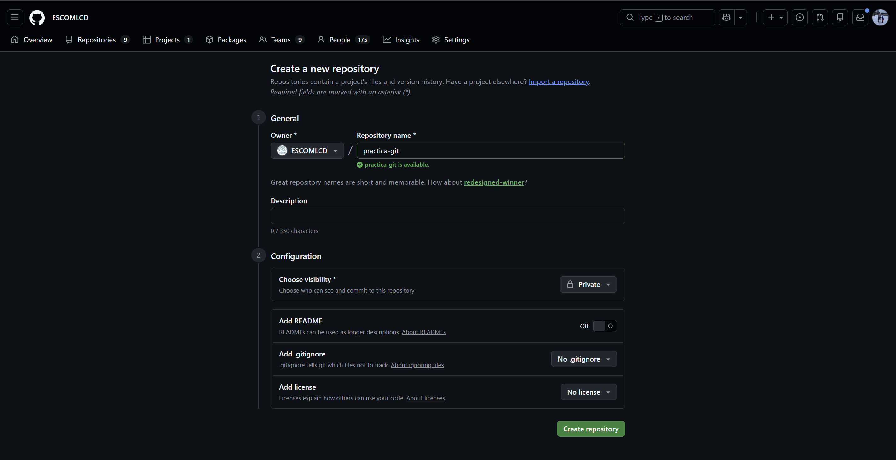
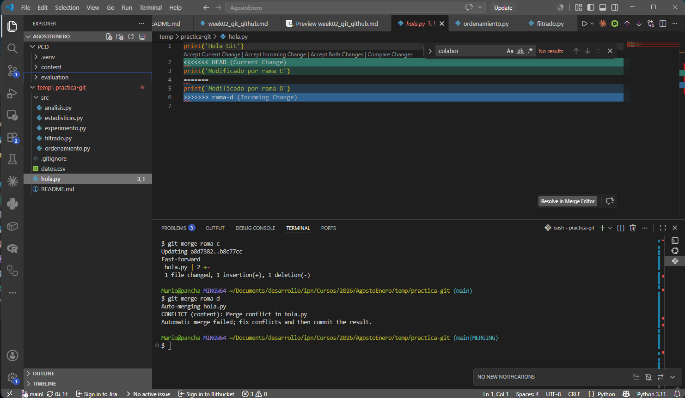
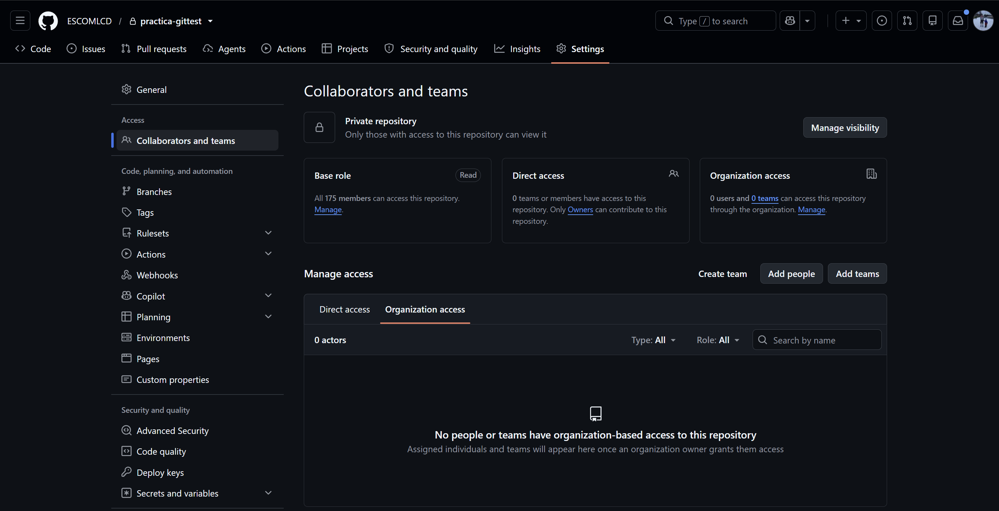
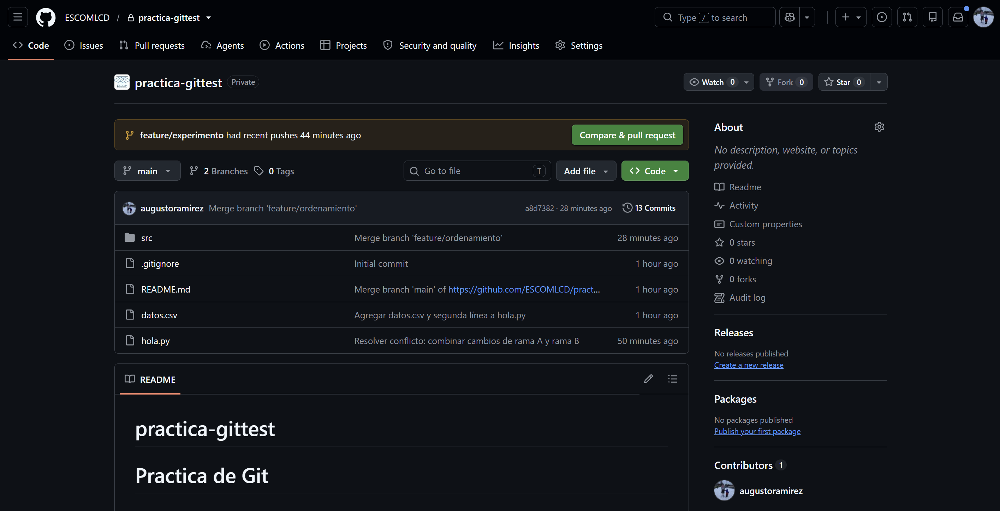

# Semana 2 — Git + GitHub (Intensivo)

**Programación para Ciencia de Datos**
Sesiones: martes 1, miércoles 2 y viernes 4 de septiembre de 2026

---

## Sesión 1 — Git local: tu máquina del tiempo

> **Nota:** en las sesiones 1 y 2 usaremos un repositorio temporal (`practica-git`) para aprender los comandos sin miedo a romper nada. En la sesión 3 (viernes) crearán el repositorio definitivo del curso (`pcd-{tema}-{seed}`) con la estructura completa del monorepo.

### ¿Qué es Git?

Git es un **sistema de control de versiones**. Piensa en él como una máquina del tiempo para tu código: cada vez que haces un "commit", Git toma una foto completa de tu proyecto. Puedes:

- Volver a cualquier punto en la historia
- Ver qué cambió, cuándo y quién lo cambió
- Trabajar en paralelo con ramas sin romper lo que ya funciona
- Colaborar con otras personas sin estorbarse

Git trabaja **localmente** en tu computadora. GitHub es un servicio en la nube para almacenar y compartir repositorios de Git — los veremos en la sesión 2.

### Conceptos clave

Antes de usar los comandos, entiende estos 3 espacios:

```
 ┌──────────────────┐   git add     ┌──────────────────┐  git commit   ┌──────────────────┐
 │  Working         │ ────────────> │  Staging Area    │ ────────────> │  Repository      │
 │  Directory       │               │  (Index)         │               │  (Historial)     │
 │                  │               │                  │               │                  │
 │  Tus archivos    │               │  "Listos para    │               │  Fotos guardadas │
 │  tal como están  │               │   la foto"       │               │  permanentemente │
 └──────────────────┘               └──────────────────┘               └──────────────────┘
```

1. **Working Directory:** tus archivos como los ves en el explorador. Puedes editarlos libremente.
2. **Staging Area (Index):** una zona intermedia donde "preparas" los cambios que quieres incluir en la próxima foto. Con `git add` mueves archivos aquí.
3. **Repository:** el historial de commits. Cada commit es una foto permanente con un identificador único (hash). Con `git commit` se guarda la foto.

### Ejercicio guiado: tu primer repositorio

Abre la terminal (Git Bash) y sigue estos pasos **uno por uno**.

#### Paso 1: Crear el repositorio

```bash
# Crear la carpeta del proyecto
$ mkdir practica-git
$ cd practica-git

# Inicializar Git en esta carpeta
$ git init
```

`git init` crea una carpeta oculta `.git/` que contiene toda la historia del proyecto. No la borres ni la modifiques manualmente.

> **Importante:** por defecto Git crea la rama principal con el nombre `master`. En este curso usaremos `main` (que es el estándar actual y el que usa GitHub). Renómbrala ahora:

```bash
$ git branch -m main
```

Esto cambia el nombre de la rama actual de `master` a `main`. Solo necesitas hacerlo una vez por repositorio. Si quieres que todos tus repositorios futuros usen `main` por defecto:

```bash
$ git config --global init.defaultBranch main
```

#### Paso 2: Ver el estado del repositorio

```bash
$ git status
```

Git te dice: "No hay commits todavía" y "No hay archivos que rastrear". El repositorio está vacío.

> **Regla de oro:** ejecuta `git status` antes y después de cada operación. Es tu brújula.

#### Paso 3: Crear archivos y agregarlos al staging

```bash
# Crear algunos archivos
$ echo "# Práctica de Git" > README.md
$ echo "print('Hola Git')" > hola.py
$ echo "__pycache__/" > .gitignore

# Ver el estado
$ git status
```

Git muestra los 3 archivos como "Untracked" (no rastreados). Aún no están en el staging.

```bash
# Agregar archivos al staging uno por uno
$ git add README.md
$ git status          # README.md aparece en verde (staged), los demás en rojo

# Agregar todos los demás
$ git add .
$ git status          # Todos en verde, listos para el commit
```

**Opciones de `git add`:**

| Comando | Qué hace |
|---|---|
| `git add archivo.py` | Agrega un archivo específico |
| `git add .` | Agrega todos los archivos nuevos y modificados |
| `git add *.py` | Agrega todos los archivos `.py` |
| `git add carpeta/` | Agrega todo el contenido de una carpeta |

#### Paso 4: Hacer el primer commit

```bash
$ git commit -m "Crear proyecto con README, hola.py y .gitignore"
```

- `-m` permite escribir el mensaje del commit directamente
- El mensaje debe describir **qué** hiciste y **por qué**, no solo "cambios" o "update"

**Buenos mensajes de commit:**
- `"Agregar script de resumen del dataset"`
- `"Corregir error en cálculo de promedio por categoría"`
- `"Eliminar archivos temporales del directorio de datos"`

**Malos mensajes de commit:**
- `"update"`, `"cambios"`, `"asdf"`, `"commit"`, `"wip"`

#### Paso 5: Ver la historia

```bash
$ git log
```

Muestra el historial de commits con:
- **Hash:** identificador único del commit (ej. `a1b2c3d4...`)
- **Autor:** tu nombre y correo (configurados con `git config`)
- **Fecha**
- **Mensaje**

```bash
# Versión compacta (una línea por commit)
$ git log --oneline

# Ver los últimos 5 commits
$ git log --oneline -5
```

#### Paso 6: Hacer más cambios y ver las diferencias

```bash
# Modificar un archivo existente
$ echo "print('Esto es una segunda línea')" >> hola.py

# Crear un archivo nuevo
$ echo "nombre,edad" > datos.csv
$ echo "Ana,25" >> datos.csv
$ echo "Luis,30" >> datos.csv

# Ver qué cambió
$ git status          # hola.py aparece como "modified", datos.csv como "untracked"

# Ver las diferencias exactas en archivos modificados
$ git diff
```

`git diff` muestra línea por línea qué se agregó (+) y qué se eliminó (-) en los archivos modificados. Solo muestra cambios que **no** están en el staging.

```bash
# Agregar y hacer commit
$ git add .
$ git commit -m "Agregar datos.csv y segunda línea a hola.py"

# Ver la historia actualizada
$ git log --oneline
```

#### Paso 7: Ver las diferencias entre commits

```bash
# Ver qué cambió en el último commit
$ git diff HEAD~1

# Ver qué cambió entre dos commits específicos (usar los hashes de git log)
$ git diff abc1234 def5678
```

`HEAD` siempre apunta al commit más reciente. `HEAD~1` es "un commit antes del actual", `HEAD~2` es dos commits atrás, etc.

### `.gitignore` — Qué NO versionar

El archivo `.gitignore` le dice a Git qué archivos o carpetas debe ignorar. Estos archivos **nunca** se agregarán al repositorio aunque hagas `git add .`.

```gitignore
# Entorno virtual
.venv/

# Archivos compilados de Python
__pycache__/
*.pyc

# Archivos del sistema operativo
.DS_Store          # Mac
Thumbs.db          # Windows

# Archivos de configuración de editores
.vscode/
.idea/

# Archivos con información sensible
.env
```

**Regla:** crea el `.gitignore` **antes** de hacer tu primer commit. Si ya hiciste commit de un archivo y luego lo agregas al `.gitignore`, Git lo seguirá rastreando. Tendrías que eliminarlo del historial con `git rm --cached archivo`.

### Ejercicio práctico 1: practica el flujo local

Haz esto por tu cuenta:

1. Dentro de `practica-git/`, crea una carpeta `src/` y dentro un archivo `analisis.py` con el contenido:

```python
# Análisis de datos - Práctica Git
datos = [10, 20, 30, 40, 50]
promedio = sum(datos) / len(datos)
print(f"Promedio: {promedio}")
```

2. Haz `git add` y un commit con un mensaje descriptivo.
3. Modifica `analisis.py` para agregar el cálculo del máximo y mínimo.
4. Antes de hacer commit, ejecuta `git diff` para ver qué cambió.
5. Haz commit con un mensaje que describa el cambio.
6. Ejecuta `git log --oneline` — deberías tener al menos 3 commits.

---

## Sesión 2 — GitHub, remotos y ramas

### Parte 1: Conectar con GitHub

#### Crear un repositorio en GitHub

Vamos a crear un repositorio en GitHub para conectarlo con el `practica-git` local que ya tienes.

1. Ir a [github.com](https://github.com/) e iniciar sesión.
2. Clic en **"+"** (esquina superior derecha) > **"New repository"**.
3. Configurar:
   - **Repository name:** `practica-git` (repo temporal de aprendizaje)
   - **Visibility:** Public
   - **Marcar:** "Add a README file"
   - **Add .gitignore:** seleccionar "Python"
4. Clic en **"Create repository"**.

> Este repositorio es temporal — lo usaremos para practicar. El repositorio real del curso lo crearán en la sesión 3.



Ahora tienes **dos repositorios separados**:
- Tu repositorio **local** (en tu computadora, con archivos y commits que ya hiciste)
- El repositorio **remoto** en GitHub (con solo un `README.md` y `.gitignore` generados por GitHub)

Necesitas conectarlos.

#### Conectar el repositorio local con el remoto

```bash
# Desde tu carpeta practica-git/ local
$ git remote add origin https://github.com/TU_USUARIO/practica-git.git
```

`origin` es el nombre convencional para el repositorio remoto principal. Puedes verificar:

```bash
$ git remote -v
origin  https://github.com/TU_USUARIO/practica-git.git (fetch)
origin  https://github.com/TU_USUARIO/practica-git.git (push)
```

#### El problema: dos historias diferentes

Tu repo local tiene commits (los que hiciste en la sesión 1). El repo remoto tiene su propio commit (el README y .gitignore que GitHub creó). Son **dos historias independientes** — Git no sabe cómo unirlas.

Si intentas hacer `git push`, Git te rechaza. Si intentas `git pull`, también falla porque las historias no están relacionadas.

#### La solución: `pull` con `--allow-unrelated-histories`

```bash
# Traer los cambios del remoto y fusionarlos con tu historia local
$ git pull origin main --allow-unrelated-histories
```

Git abrirá un editor para que escribas un mensaje del merge. Puedes dejarlo como está y cerrar el editor (en VS Code: guardar y cerrar la pestaña del mensaje; en Vim: escribir `:wq` y Enter).

Ahora tu historia local incluye tanto tus commits como el commit del remoto.

#### Subir tus cambios al remoto

```bash
# Subir tu rama main al remoto y configurarla como upstream
$ git push -u origin main
```

El `-u` (o `--set-upstream`) hace que Git recuerde que tu rama `main` local está conectada con `main` en `origin`. Después de esto, solo necesitas escribir `git push` y `git pull` sin especificar `origin main`.

```bash
# A partir de ahora:
$ git push       # sube cambios
$ git pull       # trae cambios
```

#### Verificar en GitHub

Refresca la página de tu repositorio en GitHub. Deberías ver todos tus archivos y commits.

### Parte 2: Ramas (branches)

#### ¿Para qué sirven las ramas?

Una rama es una **línea independiente de desarrollo**. Te permite trabajar en algo nuevo sin afectar el código que ya funciona en `main`.

```
          feature/analisis
         /                \
main ●──●──●──●──●──●──●──●──● (merge)
              \            /
               bugfix/error
```

- `main` es la rama principal — aquí está el código que funciona
- Creas una rama para cada tarea (nueva función, corrección de bug, experimento)
- Cuando terminas, fusionas (merge) la rama de vuelta a `main`

#### Crear y cambiar de rama

```bash
# Ver en qué rama estás
$ git branch

# Crear una nueva rama
$ git branch feature/estadisticas

# Cambiar a esa rama
$ git checkout feature/estadisticas

# Atajo: crear y cambiar en un solo comando
$ git checkout -b feature/estadisticas
```

> **Convención de nombres de ramas:** usar prefijos descriptivos como `feature/`, `bugfix/`, `docs/`, etc. Ejemplos: `feature/resumen-dataset`, `bugfix/calculo-promedio`, `docs/actualizar-readme`.

#### Trabajar en la rama

Los commits que hagas ahora solo existen en la rama `feature/estadisticas`. La rama `main` no se ve afectada.

```bash
# Verificar que estás en la rama correcta
$ git branch       # el asterisco (*) indica la rama actual

# Crear un nuevo archivo
$ cat > src/estadisticas.py << 'EOF'
import statistics

datos = [10, 20, 30, 40, 50, 60, 70]
print(f"Media: {statistics.mean(datos)}")
print(f"Mediana: {statistics.median(datos)}")
print(f"Desviación: {statistics.stdev(datos):.2f}")
EOF

# Commit en la rama
$ git add .
$ git commit -m "Agregar script de estadísticas descriptivas"
```

#### Ver las diferencias entre ramas

```bash
# Ver qué archivos son diferentes entre dos ramas
$ git diff main..feature/estadisticas --name-only

# Ver las diferencias completas
$ git diff main..feature/estadisticas
```

#### Fusionar una rama (merge)

Cuando terminas el trabajo en tu rama, la fusionas de vuelta a `main`:

```bash
# Primero, volver a main
$ git checkout main

# Verificar: ¿estadisticas.py existe aquí?
$ ls src/
# No existe — porque ese archivo solo está en la otra rama

# Fusionar la rama
$ git merge feature/estadisticas

# Verificar: ahora sí existe
$ ls src/

# Ver la historia
$ git log --oneline --graph
```

El flag `--graph` muestra visualmente las ramas y merges.

#### Eliminar una rama ya fusionada

```bash
$ git branch -d feature/estadisticas
```

Solo elimina la etiqueta de la rama — los commits siguen en la historia.

### Parte 3: Navegación en la historia

#### Checkout de un commit específico

Puedes "viajar en el tiempo" a cualquier punto de la historia:

```bash
# Ver la historia
$ git log --oneline

# Ejemplo de salida:
# f4e5d6c Agregar script de estadísticas descriptivas
# a1b2c3d Agregar datos.csv y segunda línea a hola.py
# 9z8y7x6 Crear proyecto con README, hola.py y .gitignore

# Ir a un commit específico
$ git checkout a1b2c3d
```

Git te muestra un mensaje de "detached HEAD" — estás viendo el proyecto como estaba en ese momento, pero no estás en ninguna rama. Puedes ver los archivos, pero no deberías hacer commits aquí.

```bash
# Para regresar a donde estabas
$ git checkout main
```

#### Checkout de un archivo desde otra rama

Puedes traer un archivo específico de otra rama **sin cambiar de rama**. Primero, vamos a crear una rama con un archivo para demostrarlo:

```bash
# Crear una rama con un archivo nuevo
$ git checkout -b feature/experimento
$ echo "print('Esto es un experimento')" > src/experimento.py
$ git add . && git commit -m "Agregar script de experimento"

# Volver a main — el archivo no existe aquí
$ git checkout main
$ ls src/experimento.py    # Error: no existe

# Traer SOLO ese archivo de la otra rama, sin cambiar de rama
$ git checkout feature/experimento -- src/experimento.py
$ ls src/experimento.py    # Ahora sí existe
$ git status               # Aparece en staging, listo para commit
```

Esto copia `src/experimento.py` tal como está en `feature/experimento` a tu rama actual. El archivo queda en tu staging, listo para commit.

#### Checkout de un archivo desde un commit anterior

También puedes recuperar la versión de un archivo como estaba en un commit pasado:

```bash
# Recuperar hola.py como estaba hace 3 commits
$ git checkout HEAD~3 -- hola.py

# O con el hash del commit
$ git checkout a1b2c3d -- hola.py
```

#### `git log` para encontrar commits

```bash
# Buscar commits por mensaje
$ git log --oneline --grep="estadísticas"

# Ver la historia de un archivo específico
$ git log --oneline -- src/analisis.py

# Ver quién modificó cada línea de un archivo
$ git blame src/analisis.py
```

### Parte 4: Resolver conflictos

> **Antes de continuar:** si tienes archivos pendientes en staging o cambios sin guardar de los ejercicios anteriores, haz un commit para dejar todo limpio:
>
> ```bash
> $ git status
> $ git add .
> $ git commit -m "Guardar cambios de ejercicios de navegación"
> $ git checkout main    # asegúrate de estar en main
> ```

Un conflicto ocurre cuando dos ramas modificaron **la misma línea** del mismo archivo. Git no sabe cuál versión mantener y te pide que decidas.

#### Ejercicio guiado: provocar un conflicto

```bash
# Asegúrate de estar en main
$ git checkout main

# Crear una rama A y modificar la línea 2 de hola.py
$ git checkout -b rama-a
$ cat > hola.py << 'EOF'
print('Hola Git')
print('Modificado por rama A')
EOF
$ git add . && git commit -m "Modificar hola.py en rama A"

# Volver a main y crear una rama B que modifica la misma línea
$ git checkout main
$ git checkout -b rama-b
$ cat > hola.py << 'EOF'
print('Hola Git')
print('Modificado por rama B')
EOF
$ git add . && git commit -m "Modificar hola.py en rama B"

# Volver a main y fusionar rama-a (sin conflicto)
$ git checkout main
$ git merge rama-a     # OK, fast-forward

# Ahora fusionar rama-b (¡conflicto!)
$ git merge rama-b
```

Git te dirá que hay un conflicto en `hola.py`. Si abres el archivo, verás:

```
print('Hola Git')
<<<<<<< HEAD
print('Modificado por rama A')
=======
print('Modificado por rama B')
>>>>>>> rama-b
```

#### Resolver el conflicto

1. Abrir `hola.py` en VS Code (que resalta los conflictos con colores).



2. Decidir qué mantener: VS Code te ofrece botones "Accept Current Change", "Accept Incoming Change", "Accept Both Changes". También puedes editar manualmente.

3. Eliminar las marcas de conflicto (`<<<<<<<`, `=======`, `>>>>>>>`) y dejar el código como quieres que quede:

```python
print('Hola Git')
print('Modificado por rama A y rama B')
```

4. Guardar, agregar y hacer commit:

```bash
$ git add hola.py
$ git commit -m "Resolver conflicto: combinar cambios de rama A y rama B"
```

#### Subir ramas al remoto

```bash
# Subir una rama existente al remoto
$ git push -u origin feature/experimento

# Ver todas las ramas (locales y remotas)
$ git branch -a
```

### Ejercicio práctico 2: ramas y merge

> **Antes de continuar:** sincroniza tu rama local con el remoto para que estén al día:
>
> ```bash
> $ git checkout main
> $ git push
> ```

1. Crea una rama `feature/filtrado` desde `main`.
2. En esa rama, crea un archivo `src/filtrado.py` que filtre una lista de números y deje solo los mayores a 25:

```python
datos = [10, 30, 5, 45, 20, 35, 15, 50]
filtrados = [x for x in datos if x > 25]
print(f"Originales: {datos}")
print(f"Filtrados (>25): {filtrados}")
```

3. Haz commit en la rama.
4. Vuelve a `main` — verifica que `filtrado.py` no existe.
5. Crea otra rama `feature/ordenamiento` desde `main`.
6. En esa rama, crea un archivo `src/ordenamiento.py`:

```python
datos = [10, 30, 5, 45, 20, 35, 15, 50]
ascendente = sorted(datos)
descendente = sorted(datos, reverse=True)
print(f"Ascendente: {ascendente}")
print(f"Descendente: {descendente}")
```

7. Haz commit.
8. Vuelve a `main` y fusiona ambas ramas (primero `feature/filtrado`, luego `feature/ordenamiento`).
9. Verifica con `git log --oneline --graph` que ambas ramas fueron fusionadas.
10. Sube todo al remoto con `git push`.

---

## Sesión 3 — Crear el repositorio del curso y trabajo colaborativo

En las sesiones 1 y 2 practicaste Git con un repositorio temporal. Ahora vas a crear el **repositorio real** que usarás durante todo el semestre, configurar la colaboración con tu pareja y practicar el flujo de trabajo en equipo.

### Paso 1: Formación de parejas y elección de tema

**Hoy deben quedar definidos:**

1. **Tu pareja de prácticas** — con quién trabajarás las 6 prácticas del semestre.
2. **Tu tema** — elige uno de los 10 temas disponibles (máximo 2 parejas por tema):

| Tema | Dominio | Seeds disponibles |
|---|---|---|
| `ventas_online` | Comercio electrónico | 1, 2 |
| `resenas_cursos` | Educación en línea | 3, 5 |
| `boletos_deportivos` | Eventos deportivos | 8, 13 |
| `citas_medicas` | Salud | 21, 34 |
| `reportes_transito` | Tránsito urbano | 55, 89 |
| `pedidos_domicilio` | Comida a domicilio | 144, 233 |
| `streaming_musical` | Música digital | 377, 610 |
| `tickets_soporte` | Soporte técnico | 987, 1597 |
| `inspeccion_agricola` | Agricultura | 2584, 4181 |
| `reservaciones` | Turismo y hospedaje | 6765, 10946 |

Una vez que elijan su tema, el profesor les asignará un **seed** y les entregará su archivo `{tema}-ruido.csv`.

### Paso 2: Crear el repositorio del curso en GitHub

**Un miembro de la pareja** (el "dueño") crea el repositorio:

1. Ir a [github.com](https://github.com/) > **"+"** > **"New repository"**.
2. Configurar:
   - **Repository name:** `pcd-{tema}-{seed}` (ej. `pcd-ventas_online-42`)
   - **Visibility:** Public
   - **Marcar:** "Add a README file"
   - **Add .gitignore:** seleccionar "Python"
3. Clic en **"Create repository"**.

### Paso 3: Agregar colaboradores

El dueño del repositorio:

1. Ir al repositorio en GitHub.
2. **Settings** > **Collaborators** > **Add people**.
3. Buscar por nombre de usuario de GitHub y agregar a:
   - Tu pareja de prácticas (buscar por su usuario de GitHub)
   - El profesor (usuario: **`augustoramirez`**)



Tanto tu pareja como el profesor recibirán una invitación por correo o en sus notificaciones de GitHub. Deben **aceptarla** para poder hacer push al repositorio.

> **¿Por qué agregar al profesor?** El profesor necesita acceso para subir el archivo `{tema}-ruido.csv` a la carpeta `datos/` de tu repositorio. Este es el dataset con el que trabajarás todas las prácticas del semestre.

### Paso 4: El colaborador acepta la invitación

**La pareja** (y el profesor) que fueron invitados deben:

1. Revisar su correo o ir a [github.com/notifications](https://github.com/notifications).
2. Aceptar la invitación al repositorio.
3. Verificar que pueden ver el repositorio en `https://github.com/USUARIO/pcd-{tema}-{seed}`.

> **Importante:** hasta que la invitación no sea aceptada, el colaborador no podrá hacer push ni clonar repositorios privados. Hagan esto ahora mismo en clase para no perder tiempo.

### Paso 5: Ambos clonan el repositorio

**Cada miembro** de la pareja clona el repositorio en su computadora:

```bash
# Clonar el repo (usar la URL de GitHub del repositorio creado)
$ git clone https://github.com/USUARIO/pcd-{tema}-{seed}.git
$ cd pcd-{tema}-{seed}
```

`git clone` hace 3 cosas:
1. Descarga todo el repositorio (archivos + historia completa)
2. Crea la carpeta con el nombre del repo
3. Configura `origin` apuntando al repositorio remoto

Verificar que el remoto está bien configurado:

```bash
$ git remote -v
origin  https://github.com/USUARIO/pcd-{tema}-{seed}.git (fetch)
origin  https://github.com/USUARIO/pcd-{tema}-{seed}.git (push)
```

Verificar que están en la rama `main`:

```bash
$ git branch
* main
```

### Paso 6: Crear la estructura del monorepo

**Persona A** (el dueño) crea la estructura de carpetas y la sube:

```bash
# Crear la estructura de carpetas del monorepo
$ mkdir -p datos
$ mkdir -p practica1/src practica1/resultados
$ mkdir -p practica2/src practica2/resultados
$ mkdir -p practica3/src practica3/resultados
$ mkdir -p practica4/src practica4/resultados
$ mkdir -p practica5/src practica5/resultados
$ mkdir -p practica6/src practica6/resultados
$ mkdir -p proyecto/src proyecto/resultados proyecto/datos

# Crear el entorno virtual
$ python -m venv .venv
$ source .venv/Scripts/activate    # Windows con Git Bash

# Generar requirements.txt (estará vacío por ahora — es correcto)
(.venv) $ pip freeze > requirements.txt

# Verificar que .venv está en el .gitignore (GitHub lo generó con la plantilla Python)
$ cat .gitignore | grep venv

# Commit y push
$ git add .
$ git commit -m "Crear estructura del monorepo del curso"
$ git push
```

**Persona B** trae los cambios y crea su propio entorno virtual:

```bash
$ git pull
$ ls    # Verificar que la estructura llegó completa

# Crear su propio entorno virtual (cada quien tiene el suyo, no se comparte)
$ python -m venv .venv
$ source .venv/Scripts/activate    # Windows con Git Bash
```

### Paso 7: Verificar que ambos pueden hacer push

Es importante verificar que **Persona B** (el colaborador) también puede subir cambios:

**Persona B** crea un archivo de prueba:

```bash
# Crear un script de prueba
$ cat > practica1/src/test_setup.py << 'EOF'
print("Setup verificado - el repositorio funciona correctamente")
print("Pareja lista para la Práctica 1")
EOF

$ git add .
$ git commit -m "Persona B: verificar acceso de escritura al repositorio"
$ git push
```

Si el push funciona, la colaboración está bien configurada. Si da error, verificar que la invitación fue aceptada.

**Persona A** trae los cambios:

```bash
$ git pull
$ python practica1/src/test_setup.py    # Ejecutar para verificar
```

### Flujo de trabajo colaborativo

Cuando dos personas trabajan en el mismo repositorio, el flujo es:

```
1. git pull             ← Traer los cambios más recientes del remoto
2. (trabajar, editar)   ← Hacer tus cambios
3. git add + commit     ← Guardar tus cambios localmente
4. git pull             ← Traer cambios que tu pareja haya subido mientras trabajabas
5. (resolver conflictos si los hay)
6. git push             ← Subir tus cambios al remoto
```

> **Regla:** siempre haz `git pull` **antes** de empezar a trabajar y **antes** de hacer `git push`. Esto minimiza conflictos.

### Ejercicio práctico 3: colaboración sobre el repo del curso

Este ejercicio se hace **con tu pareja**, cada uno en su computadora, sobre el repositorio `pcd-{tema}-{seed}`.

#### Ronda 1: actualizar el README en equipo

1. **Persona A** actualiza el `README.md` con la información de la pareja. Abrir `README.md` en VS Code y reemplazar el contenido con:

```markdown
# PCD - {Tema} (seed: {seed})

## Integrantes
- Persona A: {nombre completo}
- Persona B: {nombre completo}

## Tema
{tema} — {breve descripción del dominio}

## Estructura del repositorio
- `datos/` — Dataset sintético compartido por todas las prácticas
- `practica1/` a `practica6/` — Código y resultados de cada práctica
- `proyecto/` — Proyecto final con datos reales
```

```bash
$ git add .
$ git commit -m "Actualizar README con información de la pareja"
$ git push
```

2. **Persona B** trae los cambios:

```bash
$ git pull
$ cat README.md    # Verificar que los cambios de A llegaron
```

#### Ronda 2: provocar y resolver un conflicto

1. **Persona A** y **Persona B** van a modificar `README.md` al mismo tiempo, **sin hacer pull primero**. Esto es intencional — queremos provocar un conflicto para practicar cómo resolverlo.

2. **Persona A** agrega una sección al README:

```bash
$ echo "" >> README.md
$ echo "## Herramientas" >> README.md
$ echo "- Python 3.12" >> README.md
$ echo "- Git" >> README.md
$ git add .
$ git commit -m "Persona A: agregar sección de herramientas al README"
$ git push
```

3. **Persona B** (sin hacer pull — esto es importante) agrega otra sección al README:

```bash
$ echo "" >> README.md
$ echo "## Calendario" >> README.md
$ echo "- P1: 18-sep" >> README.md
$ git add .
$ git commit -m "Persona B: agregar calendario al README"
$ git push     # ¡ERROR! rejected
```

Git rechaza el push porque el remoto tiene cambios que la Persona B no tiene.

4. **Persona B** hace pull:

```bash
$ git pull
```

Git intentará fusionar automáticamente. Si ambos modificaron las mismas líneas, Git marcará un conflicto en `README.md`.

5. **Persona B** abre `README.md` en VS Code, resuelve el conflicto manteniendo ambas secciones (Herramientas y Calendario), elimina las marcas de conflicto y guarda.

6. **Persona B** completa el merge:

```bash
$ git add README.md
$ git commit -m "Resolver conflicto en README: incluir herramientas y calendario"
$ git push
```

7. **Persona A** actualiza:

```bash
$ git pull
$ cat README.md    # Tiene las secciones de ambos
```

#### Ronda 3: trabajar con ramas

1. **Persona A** crea una rama para preparar algo de la práctica 1:

```bash
$ git checkout -b feature/practica1-notas
$ echo "# Notas para la práctica 1" > practica1/resultados/notas.md
$ echo "- Usar open() para leer el CSV" >> practica1/resultados/notas.md
$ git add .
$ git commit -m "Persona A: agregar notas para P1"
$ git push -u origin feature/practica1-notas
```

2. **Persona B** trae la rama del remoto y contribuye:

```bash
$ git fetch                              # traer referencias remotas
$ git branch -a                          # ver la rama remota
$ git checkout feature/practica1-notas   # cambiar a la rama de A
$ echo "- Contar filas y columnas" >> practica1/resultados/notas.md
$ echo "- Identificar columna categórica" >> practica1/resultados/notas.md
$ git add .
$ git commit -m "Persona B: agregar más notas para P1"
$ git push
```

3. **Persona A** trae la contribución de B y fusiona la rama a main:

```bash
$ git pull                               # traer lo que B agregó
$ cat practica1/resultados/notas.md      # verificar
$ git checkout main
$ git merge feature/practica1-notas
$ git push
```

4. **Persona B** actualiza su main:

```bash
$ git checkout main
$ git pull
$ git log --oneline --graph    # Ver la historia con la rama fusionada
```

### Pull Requests (opcional pero recomendado)

Un **Pull Request** (PR) es una forma de pedir que tus cambios en una rama sean revisados antes de fusionarse a `main`. Es el estándar en equipos profesionales.

#### Crear un Pull Request

1. Crear una rama nueva y subir cambios:

```bash
$ git checkout -b feature/mi-cambio
# ... hacer cambios, git add, git commit ...
$ git push -u origin feature/mi-cambio
```

2. Ir al repositorio en GitHub.
3. GitHub muestra un banner amarillo: "feature/mi-cambio had recent pushes — **Compare & pull request**". Clic ahí.
4. Llenar:
   - **Título:** descripción corta del cambio
   - **Descripción:** qué hiciste y por qué
5. Clic en **"Create pull request"**.



#### Revisar y fusionar

El otro miembro de la pareja puede:
1. Ir a la pestaña **"Pull requests"** del repositorio.
2. Abrir el PR, revisar los cambios en la pestaña **"Files changed"**.
3. Dejar comentarios si algo no le queda claro.
4. Si todo está bien, clic en **"Merge pull request"** > **"Confirm merge"**.

Después del merge, ambos hacen `git pull` en su `main` local para traer los cambios.

### Verificación final

Al terminar esta sesión, tu repositorio `pcd-{tema}-{seed}` en GitHub debe tener:

- [x] Estructura completa de carpetas del monorepo (practica1/ a practica6/ + proyecto/)
- [x] Carpeta `datos/` lista para recibir el dataset del profesor
- [x] `.gitignore` con las exclusiones de Python (generado por GitHub)
- [x] `README.md` con nombres de integrantes, tema y seed
- [x] `requirements.txt` (puede estar vacío)
- [x] Tu pareja como colaborador (verificado: ambos pueden hacer push)
- [x] El profesor (**`augustoramirez`**) como colaborador
- [x] Varios commits de ambos miembros de la pareja
- [x] Al menos 1 rama creada, trabajada por ambos y fusionada a main

> **Próximo paso:** el profesor subirá tu archivo `{tema}-ruido.csv` a la carpeta `datos/` de tu repositorio. Haz `git pull` la próxima vez que abras tu proyecto para traer el dataset.

---

## Resumen de comandos de Git

### Comandos locales

| Comando | Acción |
|---|---|
| `git init` | Inicializar un repositorio |
| `git status` | Ver el estado actual |
| `git add <archivo>` | Agregar al staging |
| `git add .` | Agregar todo al staging |
| `git commit -m "mensaje"` | Crear un commit |
| `git log --oneline` | Ver la historia (compacta) |
| `git log --oneline --graph` | Ver la historia con ramas |
| `git diff` | Ver cambios no staged |
| `git diff HEAD~1` | Ver cambios del último commit |

### Ramas

| Comando | Acción |
|---|---|
| `git branch` | Ver ramas locales |
| `git branch nombre` | Crear una rama |
| `git checkout nombre` | Cambiar a una rama |
| `git checkout -b nombre` | Crear y cambiar a una rama |
| `git merge nombre` | Fusionar una rama a la actual |
| `git branch -d nombre` | Eliminar rama fusionada |

### Navegación en la historia

| Comando | Acción |
|---|---|
| `git checkout <hash>` | Ir a un commit específico |
| `git checkout main` | Volver a la rama principal |
| `git checkout <rama> -- archivo` | Traer un archivo de otra rama |
| `git checkout <hash> -- archivo` | Traer un archivo de un commit pasado |
| `git blame archivo` | Ver quién escribió cada línea |

### Remotos

| Comando | Acción |
|---|---|
| `git remote add origin <url>` | Conectar con un repositorio remoto |
| `git push -u origin main` | Subir y configurar upstream |
| `git push` | Subir cambios |
| `git pull` | Traer cambios del remoto |
| `git clone <url>` | Clonar un repositorio |
| `git fetch` | Traer referencias sin fusionar |
| `git branch -a` | Ver ramas locales y remotas |

---

## Recursos adicionales

- [Documentación oficial de Git](https://git-scm.com/doc)
- [GitHub Docs — Getting started](https://docs.github.com/en/get-started)
- [Git cheat sheet (GitHub)](https://education.github.com/git-cheat-sheet-education.pdf)
- [Visualizing Git (herramienta interactiva)](https://git-school.github.io/visualizing-git/)
- [Learn Git Branching (tutorial interactivo)](https://learngitbranching.js.org/)
